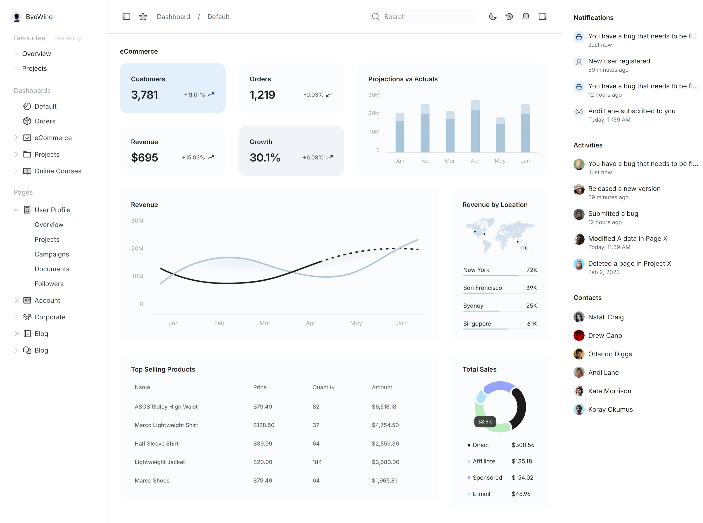
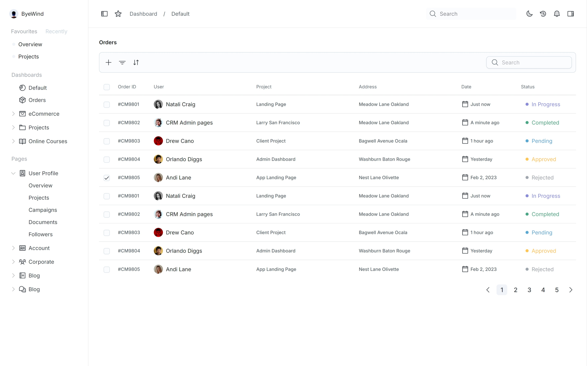
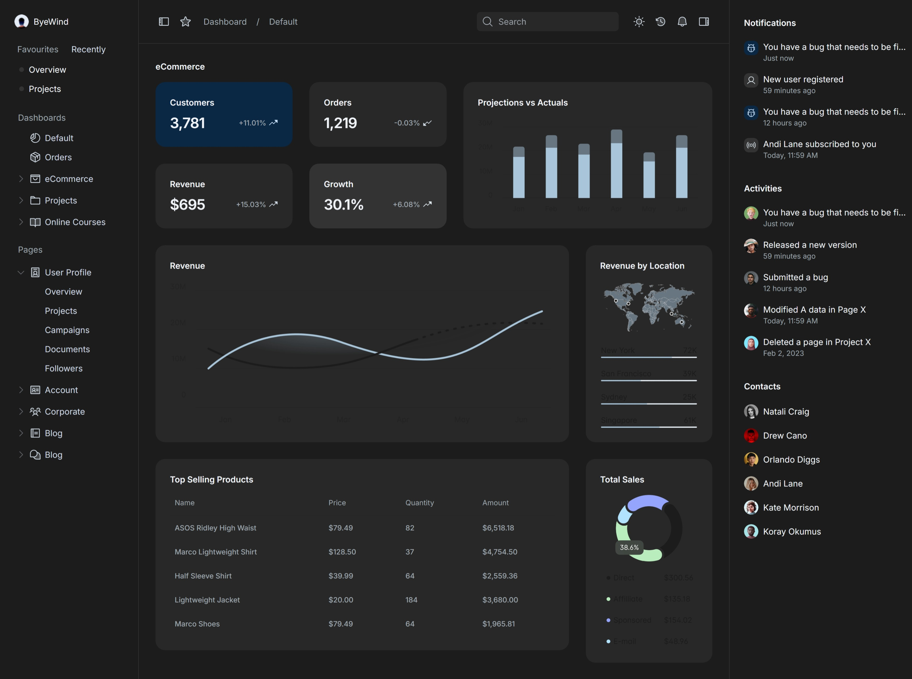
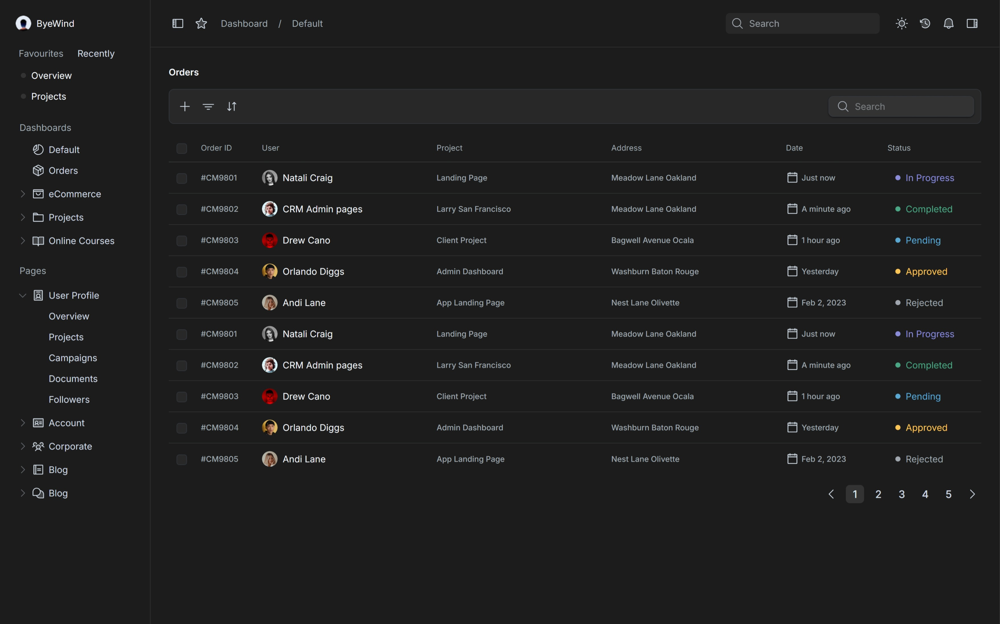

# SaaS Dashboard Implementation

The Dashboard is the central hub of the application, providing an overview of key metrics and data points in a user-friendly and visually appealing layout. This page is designed to present static, predefined data for demonstration purposes, offering a snapshot of the dashboard’s structure and features without live data integration.

> I’ve completed the assignment within the 4-day timeframe, despite my full-time work hours (9 AM to 7 PM), and have deployed the fully functional UI. Due to time constraints, I used static images for charts but ensured pixel-perfect accuracy and meaningful micro interactions in other areas.

## Live Demo

You can view the live deployment of the application [here](https://saas-dashboard-n6xv.vercel.app/).

## Screenshots
### Default

### Orders

### Default

### Orders



## Table of Contents

- [SaaS Dashboard Implementation](#saas-dashboard-implementation)
  - [Live Demo](#live-demo)
  - [Screenshots](#screenshots)
    - [Default](#default)
    - [Orders](#orders)
    - [Default](#default-1)
    - [Orders](#orders-1)
  - [Table of Contents](#table-of-contents)
  - [Getting Started](#getting-started)
    - [Prerequisites](#prerequisites)
    - [Installation](#installation)
    - [Deployment](#deployment)
  - [Project Structure](#project-structure)
  - [Design Decisions](#design-decisions)
  - [Challenges \& Improvements](#challenges--improvements)
    - [Challenges](#challenges)
    - [Improvements](#improvements)
  - [Technologies Used](#technologies-used)

## Getting Started

To run the project locally, follow these steps:

### Prerequisites

- Node.js (v16+)
- npm or yarn

### Installation

1. Clone the repository:
   ```bash
   git clone https://github.com/Sanjay-PS/saas-dashboard
   cd saas-dashboard
   ```

2. Install dependencies:
   ```bash
   npm install
   # or
   yarn install
   ```

3. Run the development server:
   ```bash
   npm run dev
   # or
   yarn dev
   ```

4. Open your browser and navigate to `http://localhost:5173`.

### Deployment

The application has been deployed using Vercel. You can access the live version at:  
[Live SaaS Dashboard](https://saas-dashboard-n6xv.vercel.app/).

## Project Structure

```
src/
|-- components/    # Reusable components
|-- context/       # Context hooks
|-- data/          # Static data
|-- layouts/       # Page layouts
|-- styles/        # Global CSS and theming
|-- utils/         # Utility functions
|-- views/         # Dashboard and orders view
|-- App.tsx        # Entry point of the application
```

## Design Decisions

1. **UI Library**: I used Material-UI Joy UI to ensure a fast and responsive UI that aligns with modern design principles. Also created a custom theme which matches the Figma mockups.
2. **Motion & Microinteractions**: Microinteractions such as hover effects, button animations, and input field transitions were included to enhance user experience.
3. **Code Quality**: The project follows best practices for structuring and modularity. Components are reusable and organized for scalability, and the CSS is modularized using CSS Modules/Styled Components.

## Challenges & Improvements

### Challenges
- **Pixel-Perfect Design**: Ensuring pixel-perfect accuracy across different screen resolutions required careful handling of breakpoints and layouts.


### Improvements
- **Responsiveness**: While the design is pixel-perfect, additional time could be invested in refining the responsiveness for smaller screen sizes. Currently, the UI is not responsive.
- **Accessibility**: Future improvements could involve adding better accessibility support (ARIA roles, better keyboard navigation).
- **Motion**: Also, animations for the components needs to incorporated.
  
## Technologies Used

- **React**: A JavaScript library for building user interfaces
- **Material UI - Joy UI**: UI component library for fast development
- **CSS3**: For styling and responsive layouts
- **HTML5**: For structuring the content
- **JavaScript (ES6+) + TS**: For logic, interactivity and stronger typed data props.

--------------

sanjay.ps@yahoo.com